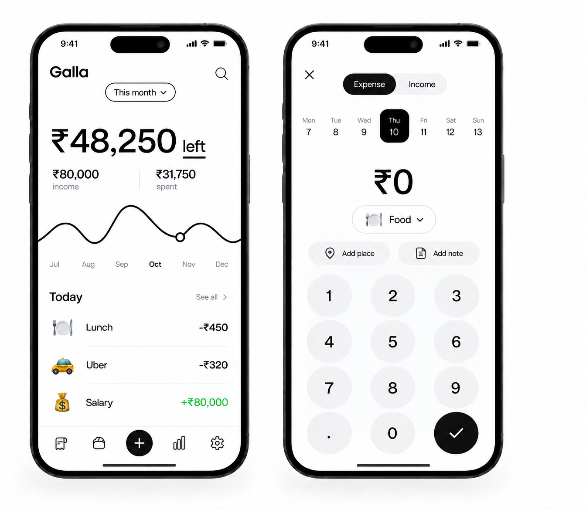

# Galla UI Revamp

## Current branch snapshot

- Branch: `worktree-siri-shortcuts`
- Upstream: `origin/worktree-siri-shortcuts`
- Base: `main` at `bc7561e`
- Feature branch: 9 commits ahead of `main`
- Committed delta: 46 files changed, 1,421 insertions, 583 deletions
- Existing uncommitted change: `financecontrol/Localizable.xcstrings`

## Delivered so far

1. Added the `Log Expense` App Intent and app-shortcut registration for Siri, Shortcuts, and Back Tap workflows.
2. Rebranded the customer-facing app from Squirrel to Galla and updated the Xcode product, bundle, schemes, widget identifiers, and supporting copy.
3. Added migration-safe default categories, including expense and income categories.
4. Added expense/income category typing, category-management tabs, and expense/income entry support.
5. Added an Analytics tab with income-left summary, income-versus-expense chart, and calendar heatmap.
6. Redesigned the Add Transaction screen with an expense/income switch, category grid, amount keypad, place, and description controls.
7. Added development-signing fallbacks needed to run Galla on a physical iPhone with a Personal Team.

## Product decisions to resolve

- The shortcut's Description parameter is labelled optional, but the current implementation requests a value on every run. Decide between truly optional and always prompted.
- The current shortcut returns silently after saving. Decide whether Back Tap should stay silent, use a short system confirmation, or open Galla.
- Keep user-created categories alongside Galla defaults and preserve existing transaction relationships during all UI work.
- Decide whether the first release is light-only or ships with a matching dark theme.

## Visual direction

Galla should feel calm, fast, and editorial rather than like a dense banking dashboard.

- Warm white and near-black foundation, with mint used only for positive money and success.
- Large rounded numeric typography for balances and transaction amounts.
- Generous whitespace, thin dividers, simple line charts, and compact pill controls.
- Emoji or consistent SF Symbols for categories; never mix icon styles within one surface.
- Motion should communicate state: numeric transitions, selection movement, sheet presentation, and save confirmation.
- Maintain Dynamic Type, VoiceOver labels, 44-point hit targets, Reduce Motion, and high-contrast support.

## Navigation model

1. Home — monthly balance, income/spend summary, trend, and recent transactions.
2. Transactions — searchable history, month/category filters, returns, and export.
3. Add — centered primary action opening the Expense/Income composer.
4. Analytics — trends, category breakdown, income versus spending, and calendar activity.
5. Settings — appearance, currency, categories, shortcuts, privacy, sync, and export.

## Screen inventory

### Primary

- Home dashboard
- Add Expense
- Add Income
- Transactions list
- Analytics overview
- Settings

### Supporting

- Transaction detail and edit
- Filters and search
- Category manager and category editor
- Currency picker and exchange rates
- Siri and Shortcuts setup
- Privacy and iCloud sync
- Export and backup
- Onboarding
- Empty, loading, error, offline, and privacy-blurred states

## Figma structure

Use an iPhone 15 Plus frame at 430 × 932 points and create these pages:

- Editable file: [Galla UI Revamp — Home + Add Transaction](https://www.figma.com/design/ilv3KSiLK9vZKiQHz3Sa61)

1. `00 Foundations` — colors, typography, spacing, radii, icon rules, and motion notes.
2. `01 Components` — buttons, pills, amount display, keypad, transaction row, category tile, cards, navigation, sheets, and states.
3. `02 Primary Flow` — Home → Add Expense/Income → Saved → Transaction Detail.
4. `03 Insights` — Transactions and Analytics.
5. `04 Manage` — Settings, Categories, Currency, Shortcuts, Sync, and Export.
6. `05 Prototype` — tap-through light and dark prototypes.

### Phase 0 discovery result

- The new file is intentionally blank and has no local components, variables, or styles yet.
- The official Apple `iOS and iPadOS 26` library is connected.
- Reuse Apple components for the device bezel, status bar, tab bar, segmented control, buttons, and standard rows.
- Reuse Apple semantic variables for backgrounds, labels, and separators.
- Create Galla-specific components for the balance summary, trend chart, category chip, transaction row, amount keypad, and centered Add action.
- The SwiftUI project uses SF Pro and SF Pro Rounded; both are available in the Figma file.
- No Code Connect mappings currently exist in the repository.

## Implementation sequence

### Phase 1 — Foundation and pilot

- Define reusable SwiftUI design tokens and components without changing persistence.
- Finalize Home and Add Transaction in Figma.
- Implement those two screens behind the existing view models.

### Phase 2 — Daily workflow

- Redesign Transactions, search, filters, detail, edit, and return flows.
- Confirm all existing swipe actions, deletion safeguards, and export entry points remain reachable.

### Phase 3 — Insights

- Apply the new visual system to Analytics.
- Add clear empty states and accessible chart summaries.

### Phase 4 — Management

- Redesign Settings, category management, currency, privacy, sync, export, and Shortcuts setup.
- Refresh onboarding using the same components.

### Phase 5 — Quality and release

- Verify small and large iPhones, iPad layouts, light/dark mode, Dynamic Type, VoiceOver, localization, and Reduce Motion.
- Test add/edit/delete/return, income/expense, migration, widget, Siri, Shortcuts, and Back Tap flows on a physical device.

## Pilot concept

The current reviewed concept covers Home and Add Transaction:

V2 incorporates review feedback: centered month control, emoji-only transaction categories without backgrounds, icon-only outline navigation, and a tappable Left/Income/Spent summary model.

This is a direction-setting raster mockup. The Figma version should rebuild it with editable Auto Layout components and exact production copy.
